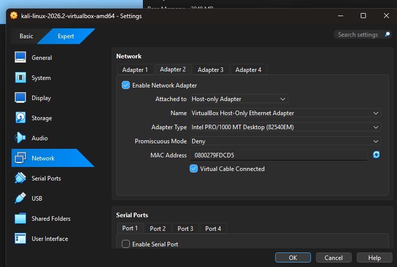
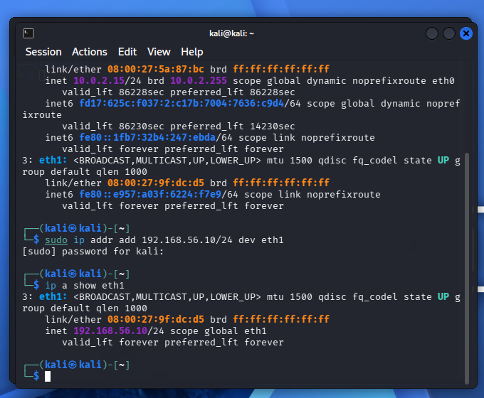
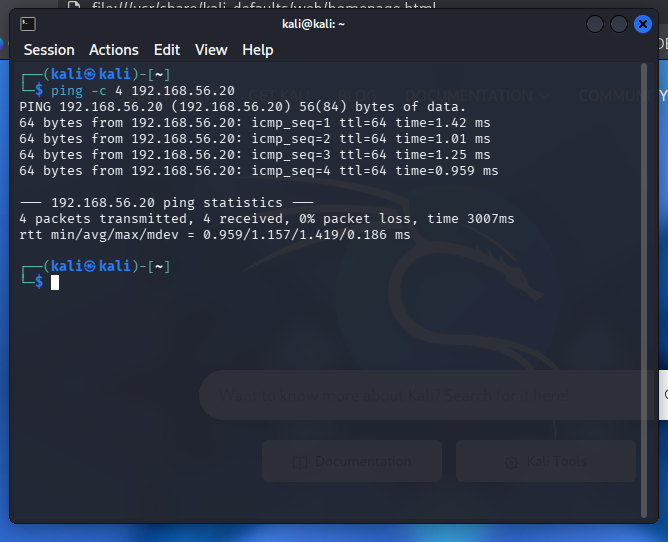
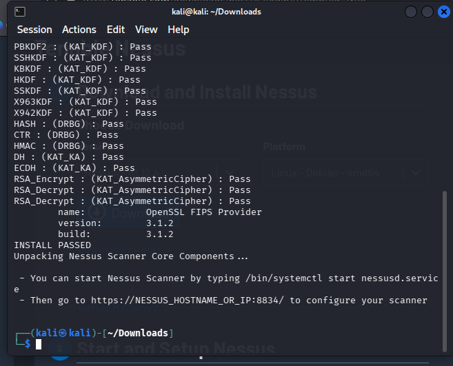
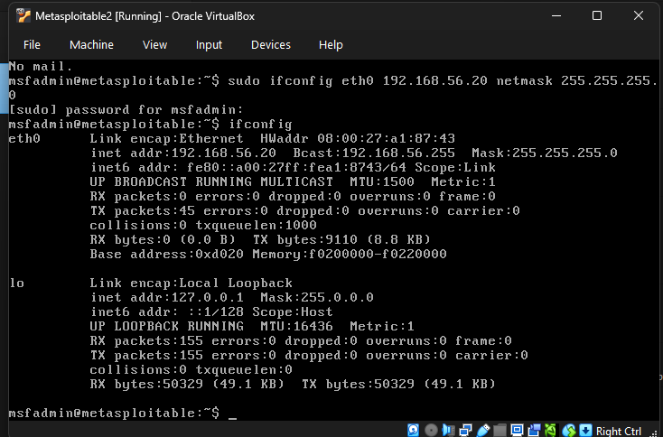
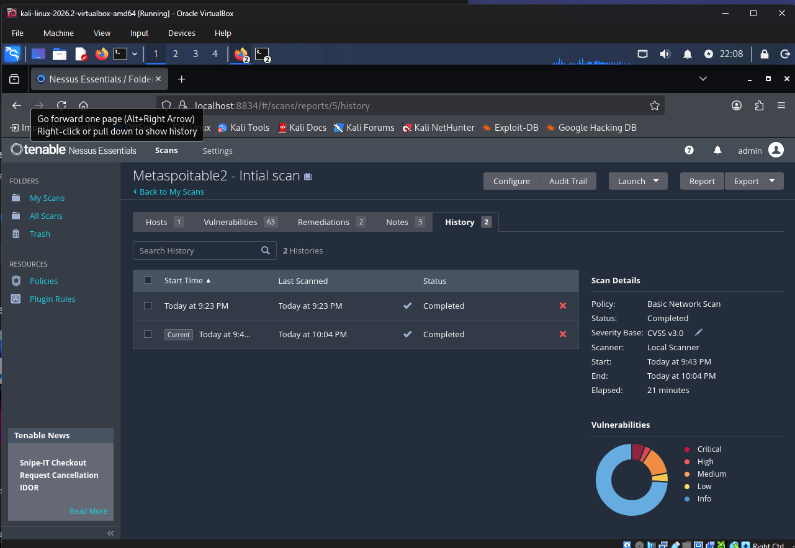
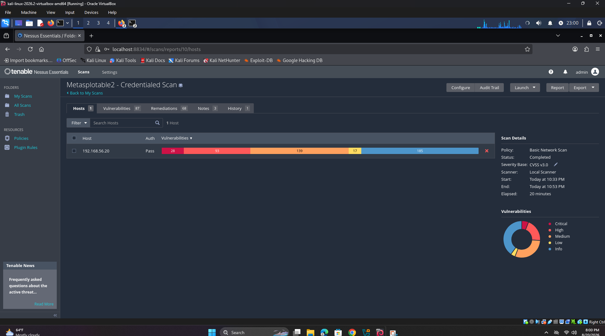
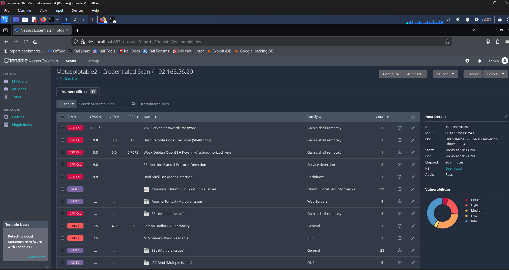

# Home Vulnerability Management Lab

A vulnerability scanning lab I built to practice the analyst workflow: set up an isolated network, scan a vulnerable target, compare uncredentialed vs. credentialed results, and write up the findings.

## What's in here

- Isolated VirtualBox network (Kali Linux + Metasploitable2)
- Nessus Essentials as the scanner
- Two scans of the same target — uncredentialed and credentialed — for comparison
- A [remediation report](./remediation-report.md) with the key findings from both

## Environment

| Component | Details |
|---|---|
| Hypervisor | VirtualBox |
| Scanner box | Kali Linux 2026.2 — `192.168.56.10` |
| Target | Metasploitable2 — `192.168.56.20` |
| Network | Host-Only, `192.168.56.0/24`, DHCP disabled |
| Scanner | Tenable Nessus Essentials 10.12.4 |

Isolated network, no internet bridging. Metasploitable2 is built to be vulnerable — not a real system.

## Build log

**1. Network setup** — Host-Only network, static IPs, verified with a ping test.

**2. Nessus install hit a snag** — the host drive filled up mid-install (an old unrelated VM eating 38GB), which crashed the VMs and corrupted Nessus's plugin database. Fixed by moving the old VM to a USB drive, freeing the space, and letting Nessus rebuild its plugins from scratch.

**3. First scan came back empty** — finished in seconds instead of minutes, which was the tell. Metasploitable2's network interface never got an IP (DHCP was off and it was expecting one). Set it manually with `ifconfig`, confirmed the connection, re-ran the scan.

**4. Uncredentialed scan** — 21 minutes, 63 findings. This is what an outside attacker with no login sees.

**5. Credentialed scan** — same scan, this time with SSH login added (`msfadmin`/`msfadmin`). Similar scan time, very different results:

| | Uncredentialed | Credentialed |
|---|---|---|
| Findings | 63 | **87** |
| Suggested fixes | 2 | **68** |

The big jump is in fixes, not just findings. With login access, Nessus could check actual installed package versions — something it can't do from outside. One single grouped finding, unpatched Ubuntu packages, expanded to **229 issues** on its own, all invisible in the uncredentialed scan.

**6. Picked five findings to write up** in detail rather than all of them:

| Finding | Severity | CVSS | From |
|---|---|---|---|
| Bind Shell Backdoor | Critical | 9.8 | Uncredentialed |
| SSL v2/v3 enabled | Critical | 9.8 | Uncredentialed |
| NFS shares wide open | High | 7.5 | Uncredentialed |
| Weak DH / Logjam | Low | 3.7 | Uncredentialed |
| 229 unpatched Ubuntu packages | Critical | ~10.0 avg | Credentialed only |

Full details and remediation steps: [remediation-report.md](./remediation-report.md)

## What's next

- Add a second target (unpatched Windows 10 VM)
- Set up recurring scans
- Re-scan after fixes to confirm they worked

## Notes

All of this was done against Metasploitable2, a VM built specifically to be scanned and broken. Isolated lab, not a real system.
