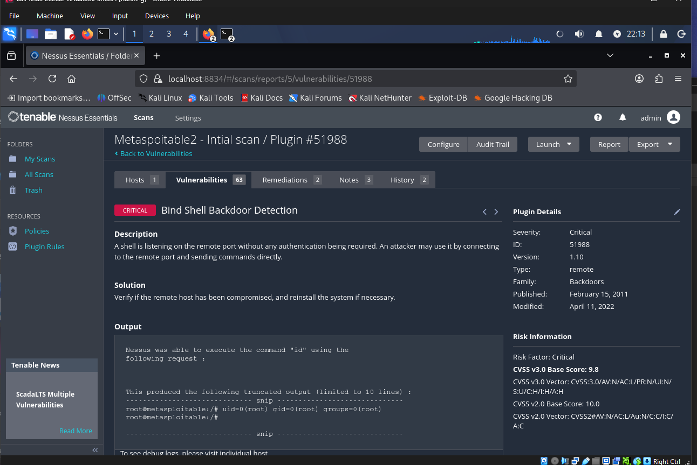
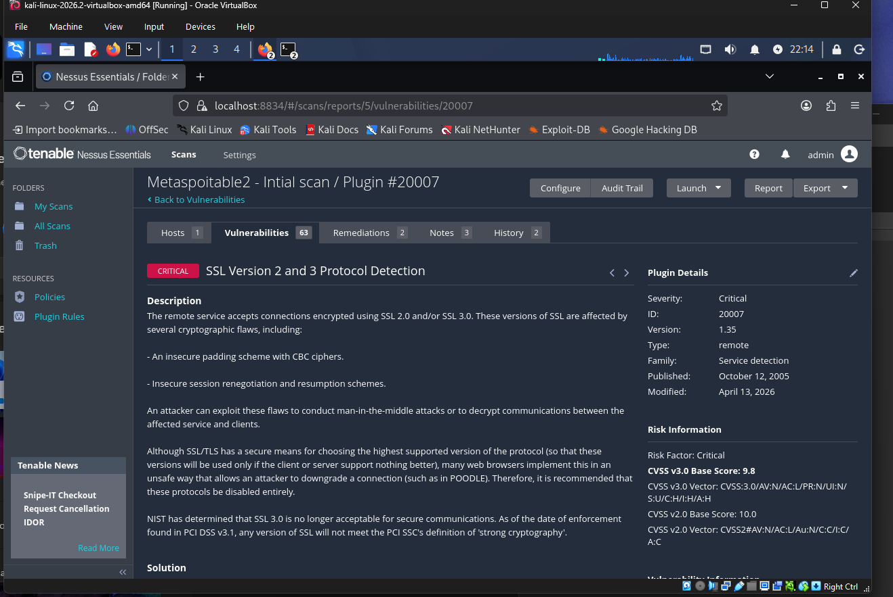
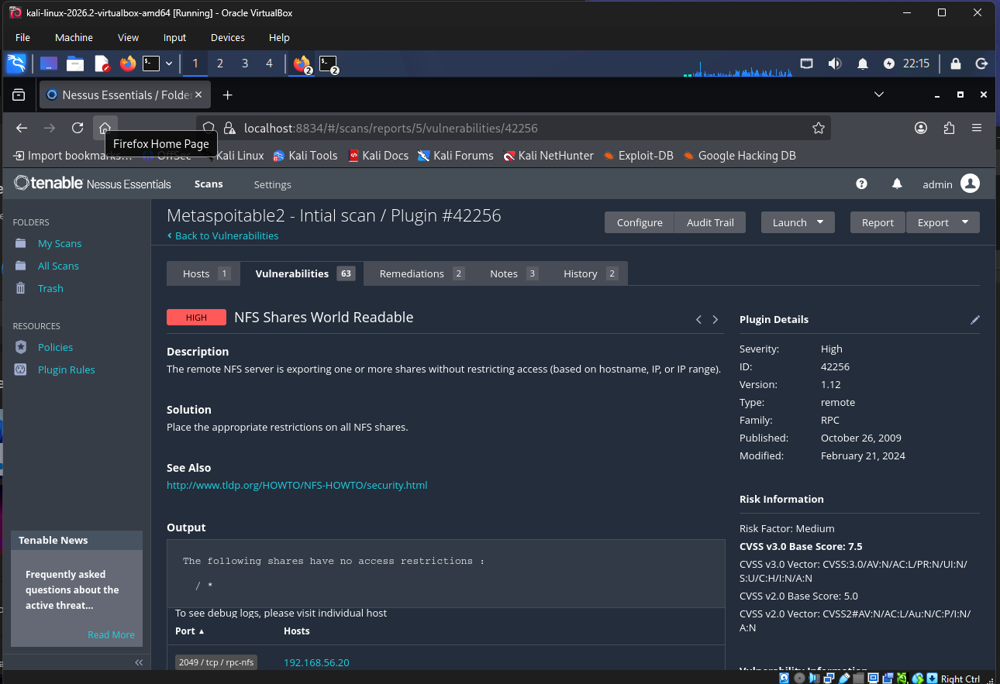
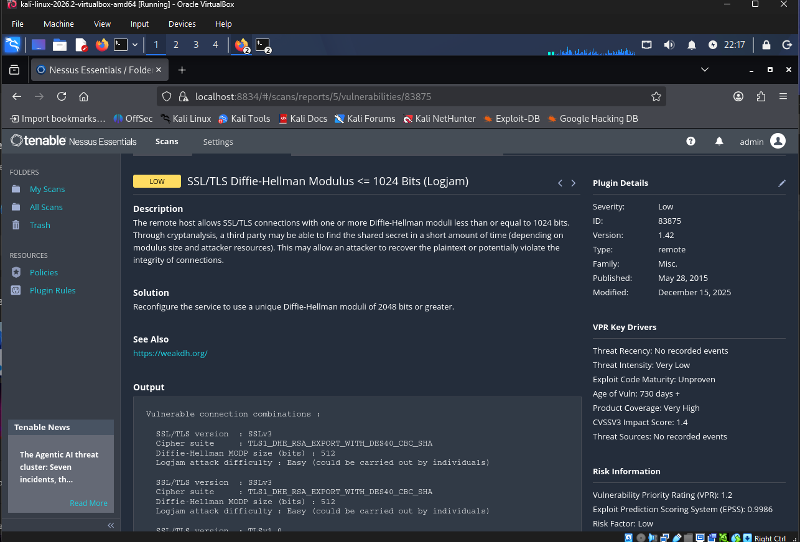

# Vulnerability Assessment Report — Metasploitable2

**Target:** 192.168.56.20
**Scanner:** Tenable Nessus Essentials 10.12.4
**Scans:** Basic Network Scan, run twice — uncredentialed and credentialed
**Date:** August 20, 2026

| | Uncredentialed | Credentialed |
|---|---|---|
| Duration | 21 min | 20 min |
| Findings | 63 | 87 |
| Suggested fixes | 2 | 68 |

## Why two scans

An uncredentialed scan shows what an attacker with no login sees from outside. A credentialed scan logs in and checks the system from the inside — installed packages, patch levels, local configs. Same box, similar scan time, very different results. Below are five findings that tell the fuller story: four from the outside view, one from the inside.

---

## 1. Bind Shell Backdoor — port 1524/tcp

**Critical — CVSS 9.8**

A shell is listening on port 1524 with no login required. Nessus connected and ran `id`, got this back:

```
root@metasploitable:/# uid=0(root) gid=0(root) groups=0(root)
```

Root access, no password, no exploit needed. Anyone on the network who can reach that port already owns the box.



**Fix:** Kill the process on port 1524 immediately. Figure out how it got there — if there's any doubt, treat the host as compromised and rebuild rather than patch around it.

---

## 2. SSL Version 2 and 3 Still Enabled

**Critical — CVSS 9.8**

The host accepts SSL 2.0 and 3.0 connections. Both have known cryptographic holes and are vulnerable to attacks like POODLE, where an attacker on the network tricks a connection into using the weaker protocol so it can be cracked.



**Fix:** Disable SSL 2.0 and 3.0 entirely. Only allow TLS 1.2+. Re-scan to confirm.

---

## 3. NFS Exporting the Whole Filesystem, No Restrictions

**High — CVSS 7.5**

```
The following shares have no access restrictions:
/ *
```

The entire filesystem is shared with no limits on who can connect — any host on the network can mount and read it.



**Fix:** Edit `/etc/exports`, restrict shares to specific trusted hosts, stop exporting the root filesystem. Only share what actually needs to be shared.

---

## 4. Weak Diffie-Hellman Key Exchange (Logjam)

**Low — CVSS 3.7**

The server allows a Diffie-Hellman key exchange with only a 512-bit modulus — well below the modern minimum. Nessus flags the difficulty of exploiting this as "Easy," which is worth taking seriously even at Low severity.



**Fix:** Bump the DH modulus to 2048 bits or higher, drop any EXPORT-grade cipher suites.

---

## 5. 229 Unpatched Ubuntu Packages (credentialed scan only)

**Critical — most rated 10.0**

This didn't show up until credentials were added. One grouped result, "Canonical Ubuntu Linux (Multiple Issues)," breaks down into 229 separate advisories — kernel, Samba, OpenSSL, GnuTLS, libxml2, and more — none of which were ever patched.

An uncredentialed scan can see a service is running and maybe guess its version, but it can't check what's actually installed against known security advisories. That only happens with login access.


**Fix:** Run a full system update rather than patching one advisory at a time. Re-scan credentialed afterward to confirm the count drops, then put the host on a regular patch schedule.

---

## Summary

| Finding | Severity | CVSS | From |
|---|---|---|---|
| Bind Shell Backdoor | Critical | 9.8 | Uncredentialed |
| SSL v2/v3 enabled | Critical | 9.8 | Uncredentialed |
| NFS shares wide open | High | 7.5 | Uncredentialed |
| Weak DH / Logjam | Low | 3.7 | Uncredentialed |
| 229 unpatched packages | Critical | ~10.0 avg | Credentialed only |

## What changed between the two scans

- Findings went from 63 to 87 — same host, only difference was adding login credentials.
- Suggested fixes went from 2 to 68. Uncredentialed can tell you something's wrong; credentialed can tell you exactly what to update.
- Whole categories of issue (patch backlog, weak SSH keys, Shellshock) only appear with local access — they're structurally invisible from outside.
- Scan time barely changed, so this wasn't about scanning longer — just about having credentials.

Bottom line: uncredentialed shows what's exposed to someone with zero access. Credentialed shows how healthy the system actually is underneath. Neither replaces the other.

## Fix order

1. Shut down the backdoor and investigate how it got there.
2. Lock down NFS — quick fix, currently wide open.
3. Disable SSL 2.0/3.0 and weak DH together.
4. Work through the patch backlog — not flashy, but the biggest actual risk.
5. Re-scan both ways to confirm, then set up a recurring schedule.

---

*Done against Metasploitable2 in an isolated VirtualBox lab, built specifically to be vulnerable. Not a real system.*
